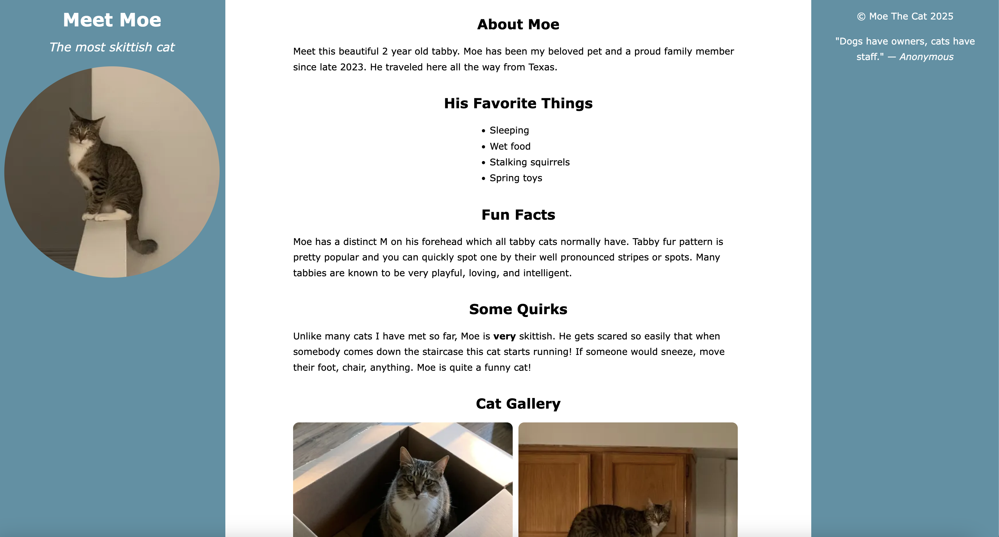
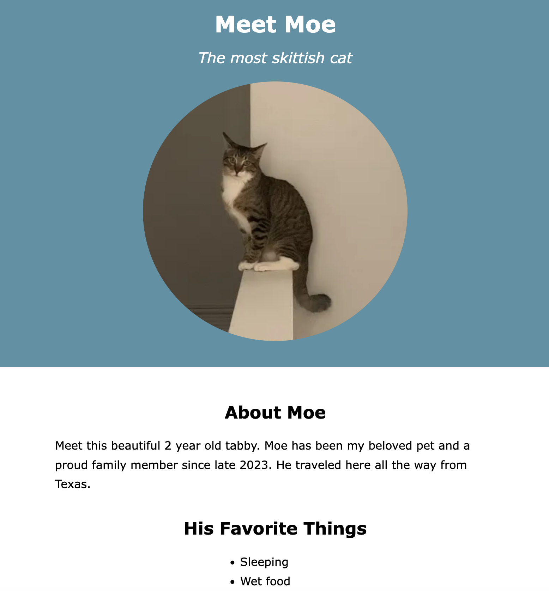

# My Cat Moe
This is a simple HTML/CSS project showcasing my cat, Moe.
The page includes:

- About Moe
- His Favorite Things
- Fun Facts
- Some Quirks
- A small cat gallery
- A footer with a quote

This project was created to practice semantic HTML, CSS flexbox, responsive design, and basic web page structure. 

## Link to this page
[View live site here](https://yanabrex.github.io/cat-moe/)

## Screenshots

### Desktop View

### Mobile View

**Technologies used:** HTML5, CSS3
